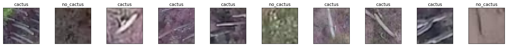

# Reconocimiento de Cactus

Consejo Nacional de Ciencia y Tecnología (CONACYT)

Instituto Politécnico Nacional (IPN).

Centro de Innovación y Desarrollo Tecnológico en Cómputo (CIDETEC).

En este notebook se realiza la clasificación de imágenes para el reconocimiento de catus en imagenes aéreas. El centro del método es una red neuronal convolucional inspirada en Lenet-5 de Yann LeCun. La red es entrenada con un conjunto de datos que recolectamos en la reserva de la biósfera Tehuacán-Cuicatlán.

Este método se desarrolló como parte del proyecto VIGIA (https://jivg.org/research-projects/vigia/). El método propuesto se encuentra publicado en :

> Efren López-Jiménez, Juan Irving Vasquez-Gomez, Miguel Angel Sanchez-Acevedo, Juan Carlos Herrera-Lozada, Abril Valeria Uriarte-Arcia, Columnar Cactus Recognition in Aerial Images using a Deep Learning Approach. Ecological Informatics. 2019. https://doi.org/10.1016/j.ecoinf.2019.05.005 

J.I. Vasquez-Gomez 

Gracias a todos los que han contribuido al proyecto. La lista completa de personas que han contribuido se encuentra en la página del proyecto.

